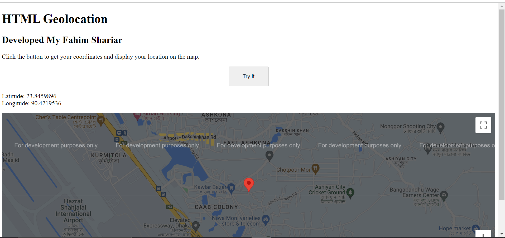

   

### 1. **Create a Google Cloud Account**
   - If you don’t have a Google Cloud account, go to the [Google Cloud Console](https://console.cloud.google.com/) and sign up. Google offers a free trial with some credits that you can use for their services.

### 2. **Create a New Project**
   - Once you’re logged in, you need to create a new project (if you don’t already have one).
   - Go to the [Google Cloud Console](https://console.cloud.google.com/).
   - Click on the project drop-down at the top and then select "New Project."
   - Give your project a name and click "Create."

### 3. **Enable the Maps JavaScript API**
   - After creating your project, you need to enable the Maps JavaScript API for that project.
   - In the Google Cloud Console, navigate to the "API & Services" > "Library."
   - Search for "Maps JavaScript API" and click on it.
   - Click the "Enable" button.

### 4. **Create API Credentials**
   - After enabling the API, you'll need to create API credentials to get your key.
   - Go to "API & Services" > "Credentials."
   - Click on "Create Credentials" and choose "API Key."
   - A pop-up will appear with your new API key. You can restrict this key by IP address, referrer, or application to prevent unauthorized use.

### 5. **Restrict Your API Key (Recommended)**
   - It’s recommended to restrict your API key to prevent unauthorized usage.
   - In the "Credentials" page, click on your API key.
   - Under "Key restrictions," you can set restrictions like:
     - **HTTP referrers (web sites):** If you're using the API key in a website, specify the domains (like `yourdomain.com`).
     - **IP addresses:** If you're using it on a server, specify the server's IP addresses.
   - Under "API restrictions," you can restrict the key to only be used with specific APIs like "Maps JavaScript API."

### 6. **Use Your API Key**
   - Copy the API key generated and use it in your HTML file as follows:

```html
<script src="https://maps.googleapis.com/maps/api/js?key=YOUR_API_KEY"></script>
```

Replace `YOUR_API_KEY` with the actual API key you created.

### 7. **Monitor Usage and Billing**
   - Monitor your API usage in the Google Cloud Console to ensure you don’t exceed your free tier limits.
   - Google offers $200 of free usage each month for Maps services, which is often sufficient for many applications.

This API key will allow you to use Google Maps services on your website or application.
